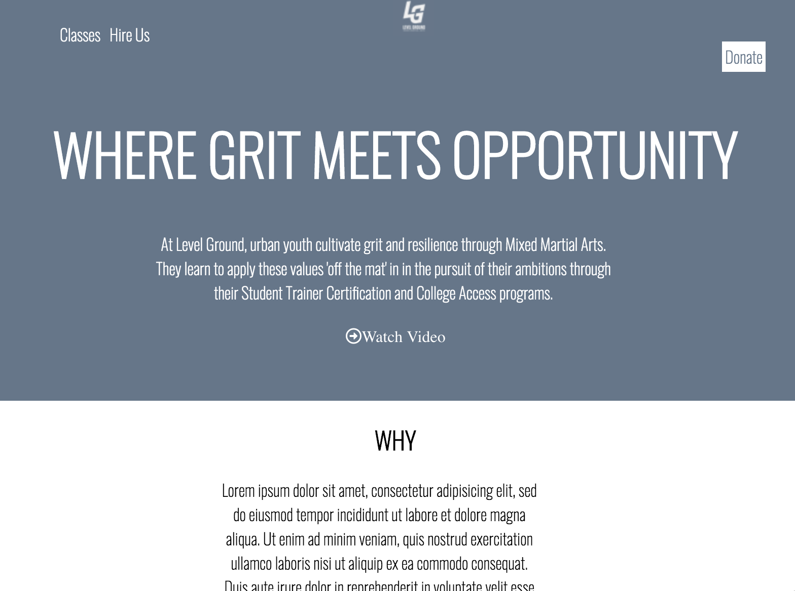

# Level Ground UI Prototype
This is a prototype of Level Ground. It is responsive to desktop, tablet and mobile devices.

**Link to project:** https://lgsite.netlify.com/

## How it's made:
**Tech Used** HTML and CSS
I built this Level Ground prototype with HTML, CSS and used media queries to make it responsive.

## Lesson Learned
This orientation of this site was fun to work with. I had some trouble trying to align everything in the beginning of my attempt at this project. However, I had fun working with the colors on this site. My biggest struggle was trying to make this website responsive for mobile. After spending time working at this site, I had a better understanding of content selection for media queries.
